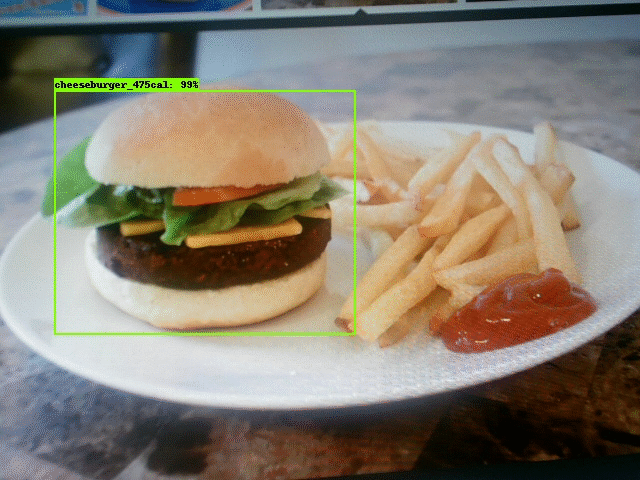

# Food_Detection
Food detection using Tensorflow Object Detection API

[Instructions are adapted from https://github.com/wagonhelm/TF_ObjectDetection_API/blob/master/README.md ]

## Required Packages
* [TensorFlow v1.3](http://www.tensorflow.org/)
* [Jupyter](http://jupyter.org/)
* [NumPy](http://www.numpy.org/)
* [Scipy](https://www.scipy.org/)
* [Matplotlib](http://matplotlib.org/)
* [Scikit-Image](http://scikit-image.org/)
* [Pandas](http://pandas.pydata.org/)
* [lxml](http://lxml.de/)
* [protobuf](https://github.com/google/protobuf)

1. Install system requirements

```bash
sudo apt-get install -y git-core wget protobuf-compiler 
```
2. Download and unzip [this entire repo from GitHub](https://github.com/wagonhelm/TF_ObjectDetection_API), either interactively, or by entering

```bash
git clone https://github.com/kumarkan/Food_Detection.git
```

3. Install Python Requirement

```bash
cd Food_Detection
# Requires sudo if not in a virtual environment
pip3 install -r requirements.txt
pip3 install tensorflow jupyter
```
4. Clone TensorFlow Models Into Repository Directory and Install Object Detection API

```bash
cd Food_Detection
git clone https://github.com/tensorflow/models.git
```

You will have to run this command every time you close your terminal unless you add the the path to slim to your `.bashrc` file

```bash
cd models/research/
protoc object_detection/protos/*.proto --python_out=.
export PYTHONPATH=$PYTHONPATH:`pwd`:`pwd`/slim
cd ..
cd ..
```

4. Launch Jupyter
```bash
jupyter notebook
```
5. Launch Tensorboard In New Terminal
```bash
tensorboard --logdir='data'
```
Once both jupyter and tensorboard are running, using your browser, navigate to the URLs shown in the terminal output if those don't work  try http://localhost:8888/ for Jupyter Notebook and http://localhost:6006/ for Tensorboard.


    

